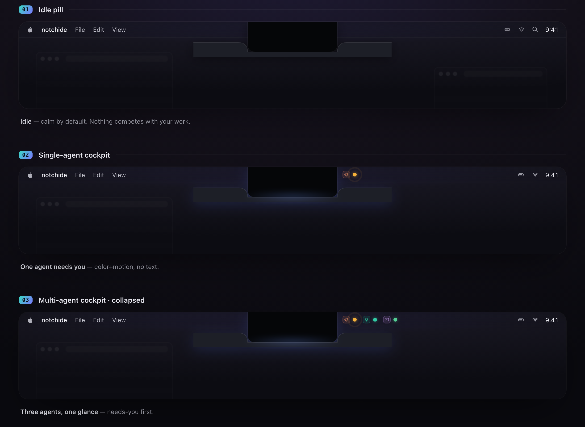
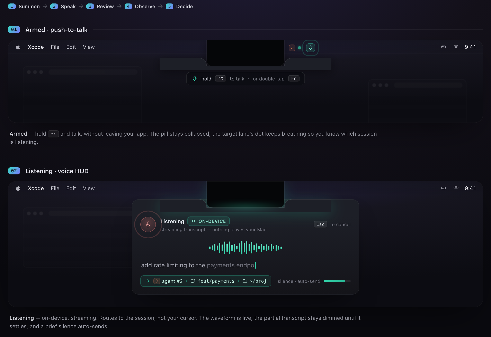
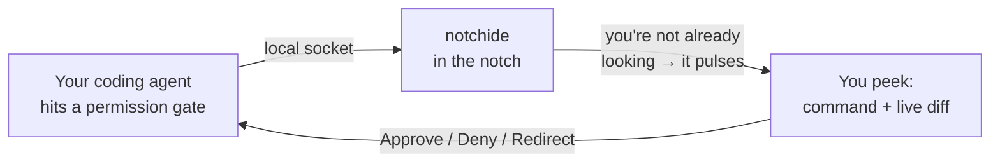

<div align="center">

# notchide

**Mission control for your coding agents — in the MacBook notch.**

Watch every AI coding session, approve or redirect the ones that block, and steer them by
voice — all from the notch, over your fullscreen work, without ever losing focus.

[](./LICENSE)
[](#compatibility)
[](https://swift.org)
[](#compatibility)

<br/>


<sub>Concept render — the notch unfurls into a read-only review panel over your fullscreen work. Focus never leaves the app you're in.</sub>

</div>

---

notchide turns the MacBook notch into an ambient cockpit for your AI coding agents. It watches
every session across every Space, taps you **only** when one is blocked waiting on a permission,
and drops a review panel out of the notch so you can decide — without leaving the app you're in.

It works with **any agent**: Claude Code ships today; Codex, Cursor, Aider, or your own connect
over a small open protocol. Everything stays **on your machine** — a local, owner-only socket,
nothing routable.

## What you can do

notchide does three things — and deliberately **never writes code for you**. It's a cockpit, not
an IDE: there's no editor, and the review console is read-only.

### Watch

One glyph per running agent, right in the notch. Colour and motion tell you which sessions are
flowing, which need you, and which are done — no text, no extra window. You read the state of
everything out of the corner of your eye.

<div align="center">

</div>

### Decide

When an agent hits a permission gate, the notch pulses. Peek, and it unfurls into a read-only
console: the exact command, a live git diff of what changed, and **Approve / Deny / Redirect**.
You decide, the panel furls back up, and the app behind you never lost focus. (That's the panel
at the top of this page.)

### Steer

Hold **⌃⌥**, say what you want, and release. Your words route to the agent **session** as a fresh
instruction — never keystrokes into whatever window has focus. Transcription runs on-device, so
nothing leaves your Mac. Voice can *start* work but can **never** approve a destructive command —
that always needs a deliberate click.

<div align="center">

</div>

## How it works



The agent blocks on the still-open socket while you decide; your decision travels back down it and
the agent continues. If notchide isn't running, the gate **fails open** — an agent is never left
hanging. A deeper walk-through is in [docs/ARCHITECTURE.md](docs/ARCHITECTURE.md).

## Connect your own agent

notchide is a platform, not a single-agent tool. An agent connects by speaking **AAP**, the Agent
Adapter Protocol: it opens the local socket, sends a one-line handshake, and streams events. It
doesn't link against notchide and can be written in any language.

- **Protocol:** [docs/PROTOCOL.md](docs/PROTOCOL.md) · **Schema:** [schema/aap-1.schema.json](schema/aap-1.schema.json) · **Examples:** [examples/](examples)

Each adapter declares what it can do — **observe** (report status), **gate** (block for your
decision), and/or **actuate** (receive voice-driven prompts). An observe-only adapter can never
seize your attention; only a gate adapter can ask you to decide.

## Install

**Notarized `.dmg` — coming soon.** notchide is a direct download, not a Mac App Store app: it
runs non-sandboxed so it can use a push-to-talk key tap and the local agent socket.

**Build from source.** The offline core has zero dependencies and builds and tests without a
network:

```sh
git clone https://github.com/Blonky/notchide.git
cd notchide
swift build      # NotchideKit + the notchide-hook CLI
swift test       # the full offline test suite
```

The GUI app lives in [`app/`](app) and is built on your Mac with Xcode (it pulls in
DynamicNotchKit). See [docs/ARCHITECTURE.md](docs/ARCHITECTURE.md) for the package layout.

**Hook up Claude Code.** notchide reads your agents through Claude Code's hook system; the
installer merges a small, reversible snippet into `~/.claude/settings.json`, with a confirm:

```sh
notchide-hook install     # adds the hook (shows a diff first)
notchide-hook uninstall   # removes exactly what it added
```

Details in [docs/HOOKS.md](docs/HOOKS.md).

## Compatibility

Apple Silicon, **macOS 13 Ventura or newer**. On a notch Mac the console morphs out of the notch;
on a non-notch Mac or an external display, notchide shows the same UI as a first-class **floating
pill**.

## Roadmap

- **v0.1** — Claude Code, the four-state cockpit, the read-only review console, voice steering.
- **v0.2** — a second built-in provider (OpenTelemetry, including Codex) and a multi-session view.
- **v0.3** — build / CI / git surfacing and a worktree browser that ties sessions to branches.
- **v1.0** — freeze the `aap/1` protocol and publish the adapter SDK.

Full detail in [docs/ROADMAP.md](docs/ROADMAP.md).

## Credits

Built on **[DynamicNotchKit](https://github.com/MrKai77/DynamicNotchKit)** (MIT) by MrKai77 — the
library that renders the notch surface, the shape morph, and the floating-pill fallback. Inspired
by the Mac notch itself and the idea of making it useful. Full attribution in
[THIRD_PARTY_LICENSES.md](THIRD_PARTY_LICENSES.md).

## Contributing & license

Contributions are welcome — see [CONTRIBUTING.md](CONTRIBUTING.md). The one rule: notchide
**notifies and decides; it never writes code for you.**

[MIT](./LICENSE) © 2026 Zac Song ([@Blonky](https://github.com/Blonky)).
