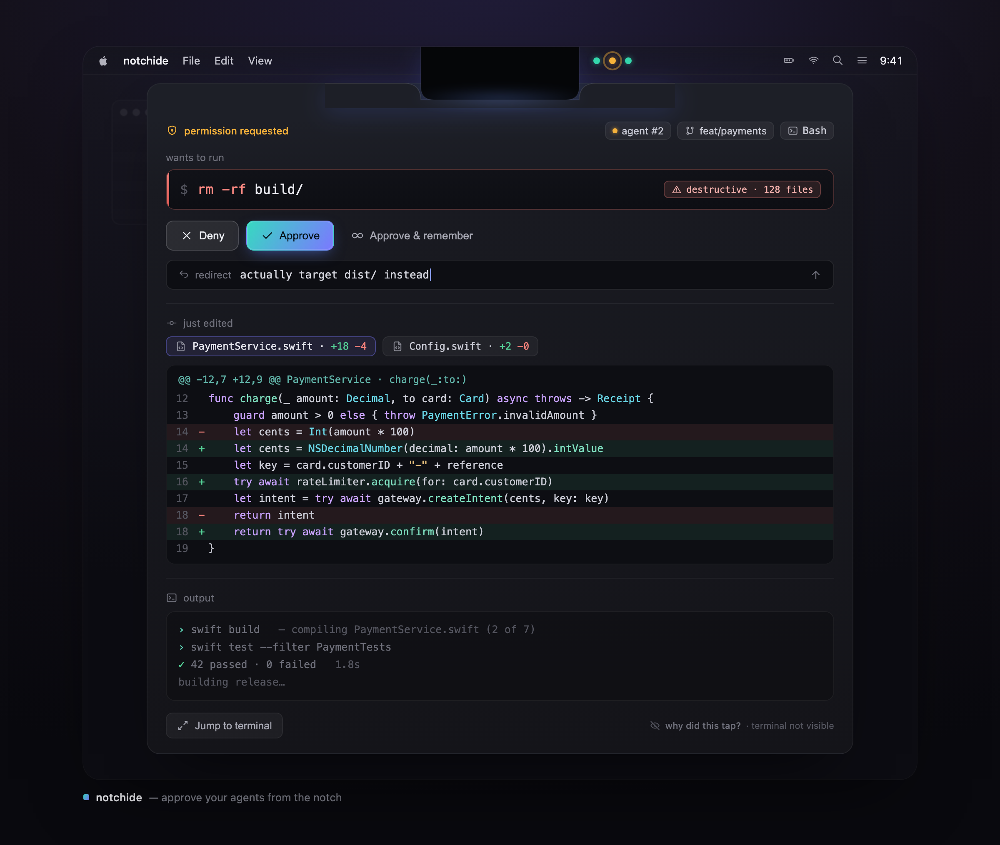

<div align="center">

# notchide

**The open notch platform for coding agents.**
Connect Claude Code, Codex, Cursor, Aider, or your own agent — and approve, deny, or redirect
from the notch, over your fullscreen work.

[](./LICENSE)
[](#compatibility)
[](https://swift.org)
[](#compatibility)

<br/>



<sub>Concept render. The notch tracks three agents (one needs you); it unfurls into a read-only approve panel over your fullscreen work — focus never leaves the app you're in.</sub>

</div>

---

notchide turns the MacBook notch into an ambient cockpit for your AI coding agents.
It watches every session across every Space, taps you **only** when one is blocked waiting on a
permission, and unfurls a live-diff + approve panel right out of the notch — so you never leave
the app you're in.

It is **agent-agnostic**: agents connect over a small, documented wire protocol —
**[AAP, the Agent Adapter Protocol](docs/PROTOCOL.md)**. Claude Code is the reference adapter that
ships today; Codex, Cursor, Aider, or your own agent connect the same way (see
[Connect any agent](#connect-any-agent)). Everything is **local-first**: a same-machine,
owner-only Unix socket, nothing routable.

It does two verbs — **NOTIFY** and **DECIDE** — and deliberately never the third,
**CREATE**. There is no code editor in notchide. It is a cockpit, not an IDE.

## What it is

notchide is **one object in two states**.

- **Collapsed — an ambient orchestration cockpit.** One pre-attentive glyph per running
  agent: color and motion, no text. Four states: `flowing`, `needs-you`, `done`, `error`.
  You read the state of every session out of the corner of your eye without reading a word.

- **Expanded — a read-only review console.** It drops down out of the notch, over your
  fullscreen work, showing the single most-urgent session: the pending permission command,
  **Approve / Deny / Approve-and-remember / one-line redirect**, a live syntax-highlighted
  git diff of what the agent just changed, and a tail of its output. You decide, and the
  panel furls back up. The app behind you was never focused.

## Demo

<!-- The demo GIF is coming. Drop it at docs/media/demo.gif and it renders here. -->


> _Demo GIF coming soon (`docs/media/demo.gif`)._

## Why notchide

There are 15+ "AI-agent-in-the-notch" tools already. Every single one is a **read-only**
status or approval pill. notchide's unclaimed move is the one **write** action they all
lack: **approve / deny / redirect from the notch**, over your fullscreen work, without
stealing focus.

- **Why the notch?** It is the only surface that floats above every fullscreen app across
  every Space. A blocked agent on Space 4 can reach you while you are heads-down in Space 1.
- **Why not a window?** A window steals focus — the exact anti-pattern the product exists to
  avoid. Pulling the notch console down never takes your keyboard unless you click into the
  reply field.

## Connect any agent

notchide is a platform, not a single-agent tool. An agent connects by speaking **AAP** — it
opens the local socket, sends a one-line handshake, and streams events. It does **not** link
notchide and can be written in any language.

- **Wire protocol:** [docs/PROTOCOL.md](docs/PROTOCOL.md) — the normative `aap/1` spec (handshake,
  envelope, decision; NDJSON over an owner-only Unix socket; UUID correlation; fail-open).
- **Schema:** [schema/aap-1.schema.json](schema/aap-1.schema.json).
- **Runnable examples:** [examples/adapters/](examples/adapters) (a ~40-line reference adapter)
  and [examples/providers/](examples/providers) (drop-in provider manifests).

**Capability model (one line).** An adapter advertises what it can do: **`observe`** (report
status — read-only) and/or **`gate`** (block the agent awaiting your decision). Only a `gate`
adapter can reach `needs-you` and show Approve/Deny/redirect; an observe-only adapter is
*notify-only* and structurally cannot seize you.

Claude Code ships in v0.1; other agents are the documented [roadmap](docs/ROADMAP.md).

## Features (v0.1)

- **Four-state glyph cockpit** — one pre-attentive glyph per session (`flowing` / `needs-you`
  / `done` / `error`), color + motion, no text.
- **Read-only review console** — pending command, `Approve` / `Deny` / `Approve-and-remember`
  / one-line redirect, a live syntax-highlighted git diff, and an output tail.
- **Claude Code hook bridge** — a `notchide-hook` sidecar forwards Claude Code hook events
  over a local Unix-domain socket. `PreToolUse` blocks synchronously awaiting your decision,
  with a **hard timeout and fail-open** so an agent is never bricked if notchide is down.
- **Smart suppression** — a session only escalates to `needs-you` when its terminal is *not*
  the frontmost window on the active Space. notchide never taps you about something you can
  already see.
- **Hover-intent peek** — a ~200 ms intent delay so menu-bar mouse travel never mis-triggers
  the console.
- **Focus preservation** — dropping the console down never steals keyboard focus.
- **Jump to terminal** — an escape hatch to the underlying terminal for anything the hook
  can't answer.
- **Floating-pill fallback** — a first-class pill for external monitors and non-notch Macs.
- **Silence by default** — notchide only speaks up on hard blocks. Per-session + global mute,
  plus a one-line "why did this tap?" explanation on every escalation.
- **~0% idle CPU** — fully event-driven, zero polling.

## How it works

notchide is four layers. Events flow up from Claude Code; a decision flows back down the
same still-open socket.

1. **Notch Shell** — SwiftUI/AppKit. Uses [DynamicNotchKit](https://github.com/MrKai77/DynamicNotchKit)
   (MIT) for the `NSPanel` geometry, the animatable notch-shape morph, and the floating-pill
   fallback. A thin `NotchController` owns the collapsed pill, the expanded console, the
   hover-intent state machine, ESC/pin/auto-collapse timers, and a global summon hotkey.
2. **Ingest** — agents connect over AAP to a Unix-domain socket at
   `~/Library/Application Support/notchide/agent.sock` (mode `0600`). `SocketAAPProvider` and the
   `ProviderRegistry` fan every provider's events into a `SessionStore` actor, one lane per
   session. The `notchide-hook` CLI is the reference adapter for Claude Code.
3. **Attention Router** — a `Suppressor` escalates a lane to `needs-you` only when its
   terminal is not frontmost on the active Space. It drives the four-state glyph machine.
4. **Review Surface** — SwiftUI. Renders the pending command, the decision buttons and the
   one-line redirect (round-tripped back through the waiting hook), a read-only
   syntax-highlighted live git diff, and a lightweight output tail.

### Data flow

```
  Claude Code                                            notchide.app
  ┌──────────────┐                                   ┌──────────────────────┐
  │ hits a       │   runs notchide-hook              │                      │
  │ permission   │──────────────┐                    │  SessionStore actor  │
  │ gate         │              ▼                     │  (one lane / session)│
  └──────────────┘        ┌───────────┐   unix sock   │          │           │
        ▲                 │notchide-  │ agent.sock ───▶│   lane → needs-you   │
        │  hook prints    │  hook CLI │  (NDJSON,0600) │          │           │
        │  decision JSON, │(fail-open,│               │          ▼           │
        │  exits 0        │  blocks)  │◀── decision ───│      Suppressor      │
        │                 └───────────┘   (same sock)  │  frontmost? hidden → │
        │                       ▲                      │  pulse amber + tap   │
        │                       │                      └──────────┬───────────┘
        │                       │                                 ▼
        │                       │                        user hovers / hotkey
        │                       │                                 ▼
        │                       │                        console morphs down:
        │                       │                        command + diff + tail
        │                       │                                 ▼
        └───────────────────────┘◀──────────────────────  user clicks Approve
                                       decision travels
                                       back down socket
```

The agent proceeds; the lane goes green; the panel furls up. **The app behind you was never
focused.** A full walk-through lives in [docs/DESIGN.md](docs/DESIGN.md) and the wire-level
detail in [docs/ARCHITECTURE.md](docs/ARCHITECTURE.md).

## Install

### Notarized .dmg (coming soon)

notchide ships as a **notarized, direct-download `.dmg`** — not via the Mac App Store. This
is deliberate: drawing above fullscreen apps and the lock screen, and hiding from screen
capture, needs private frameworks (SkyLight / `CGSSpace`) that the App Store forbids. The
first engineering milestone is a notarization smoke test proving a private-framework `.dmg`
passes Apple notarization before we build on it.

> Direct-download `.dmg`: **coming soon.**

### Build from source

The repository is split into two SwiftPM packages:

- The **root package** — `NotchideKit` (the pure core) plus the `notchide-hook` CLI and the
  test suite. It has **zero external dependencies**, so it builds and tests fully offline.
- The nested **`app/` package** — the SwiftUI/AppKit GUI. It depends on DynamicNotchKit and
  `NotchideKit` (via a local path) and is built on your Mac with Xcode.

Build and test the offline core:

```sh
git clone https://github.com/Blonky/notchide.git
cd notchide
swift build      # builds NotchideKit + notchide-hook
swift test       # runs the offline test suite
```

Build the GUI app (needs Xcode + network for DynamicNotchKit):

```sh
cd app
xcodegen generate          # generate notchide.xcodeproj from project.yml
open notchide.xcodeproj     # then build & run the `notchide` scheme in Xcode
```

> The `app/` package is built on the developer's Mac. It pulls DynamicNotchKit over the
> network and is not part of the offline CI job. See
> [docs/ARCHITECTURE.md](docs/ARCHITECTURE.md) for the full package layout.

### Set up the Claude Code hook

notchide reads your agents through Claude Code's hook system. The installer merges a small
snippet into `~/.claude/settings.json` — it is **additive, reversible, and asks for consent**
before writing:

```sh
notchide-hook install     # merges the hook into ~/.claude/settings.json (with a diff + confirm)
notchide-hook uninstall   # cleanly removes exactly what it added
```

The exact hooks it registers (`PreToolUse`, `Notification`, `Stop`, `SubagentStop`), the
snippet it writes, the fail-open guarantee, and troubleshooting are documented in
[docs/HOOKS.md](docs/HOOKS.md).

## Usage

- **Peek** — hover the notch (after a ~200 ms intent delay) to drop the console for the most
  urgent session. It never triggers on incidental menu-bar mouse travel.
- **Summon** — a global hotkey opens the single most-urgent blocked session from anywhere,
  even over a fullscreen app.
- **Decide** — `Approve`, `Deny`, `Approve-and-remember` (remembers that exact command
  string), or type a **one-line redirect** to steer the agent. On anything ambiguous the
  default is **Deny**. notchide never auto-approves.
- **Pin / dismiss** — click-to-pin keeps the console open; `ESC` or auto-collapse furls it up.
- **Mute** — per-session or global mute when you want silence.
- **Why did this tap?** — every escalation carries a one-line reason so you always know why
  notchide surfaced.

Focus is preserved throughout: pulling the console down never steals your keyboard unless you
deliberately click into the reply field.

## Compatibility

- **Apple Silicon** (arm64), **macOS 13 Ventura or newer**.
- **Notch and non-notch Macs.** On a notch Mac the console morphs out of the notch; on a
  non-notch Mac (or an external display) notchide renders the same UI as a first-class
  **floating pill**.
- **External displays.** The floating-pill fallback follows you to external monitors where
  there is no physical notch.

## Roadmap

- **Foundation — AAP (landed in the core):** the vendor-neutral Agent Adapter Protocol
  ([docs/PROTOCOL.md](docs/PROTOCOL.md)) — `AgentEvent`/capability model, `aap/1` wire format,
  `SocketAAPProvider` + provider registry/manifests, Claude Code as the reference provider.
- **v0.1 — the wedge (Claude Code ships):** notch shell + floating fallback, four-state glyph
  cockpit, Claude Code adapter over the AAP socket, smart suppression, read-only review console
  (command + Approve/Deny/redirect + live git diff + output tail), jump-to-terminal,
  one-command reversible installer, notarized `.dmg` + demo GIF, Show HN.
- **v0.2:** a second **built-in** provider — an OpenTelemetry OTLP `:4318` passive listener
  (notify-only, incl. Codex) proving the abstraction — plus a multi-session stack view,
  token/cost/tool-timeline, usage-% glyph, inline reply-inject behind a flag, and an optional
  SwiftTerm terminal peek.
- **v0.3:** builds / CI / git (Xcode build status, `gh` PR/CI checks), a NotchFlow-style
  worktree browser tying sessions to branches, optional on-demand inline editing.
- **v1.0:** freeze `aap/1` + publish the adapter SDK + community adapters (Codex, Cursor, Aider,
  OpenClaw, custom agents); hardened private-framework feature-detection across macOS point
  releases.

The full milestone breakdown is in [docs/ROADMAP.md](docs/ROADMAP.md).

## Architecture

The engineering view — package layout, the two platform planes, key types, and the concurrency
model — is in [docs/ARCHITECTURE.md](docs/ARCHITECTURE.md); the normative wire protocol is in
[docs/PROTOCOL.md](docs/PROTOCOL.md); the product + system design of record is in
[docs/DESIGN.md](docs/DESIGN.md). See [docs/media/gallery.html](docs/media/gallery.html) for the
full display system.

## Contributing

Contributions are welcome. Please read [CONTRIBUTING.md](CONTRIBUTING.md) first — it covers
how to build and test, the module boundaries, the Swift 6 strict-concurrency style, and the
one design principle every change must respect: **NOTIFY + DECIDE, never CREATE.**

## Credits & prior art

notchide stands on the shoulders of a rich "notch tools" ecosystem. With respect and
gratitude:

- **[DynamicNotchKit](https://github.com/MrKai77/DynamicNotchKit)** by MrKai77 (MIT) — the
  notch substrate notchide depends on for panel geometry, the shape morph, and the pill
  fallback.

Prior art we studied but did **not** fork:

- **klo-local** by elvniv (Apache-2.0)
- **NotchFlow** (MIT)
- **CodeIsland** (MIT)
- **Claude Island** (Apache-2.0)
- **boring.notch** (CC-BY-NC-ND — study only; not incorporated)

Full attribution and license notes are in [THIRD_PARTY_LICENSES.md](THIRD_PARTY_LICENSES.md).

## License

[MIT](./LICENSE) © 2026 Zac Song ([@Blonky](https://github.com/Blonky)).
