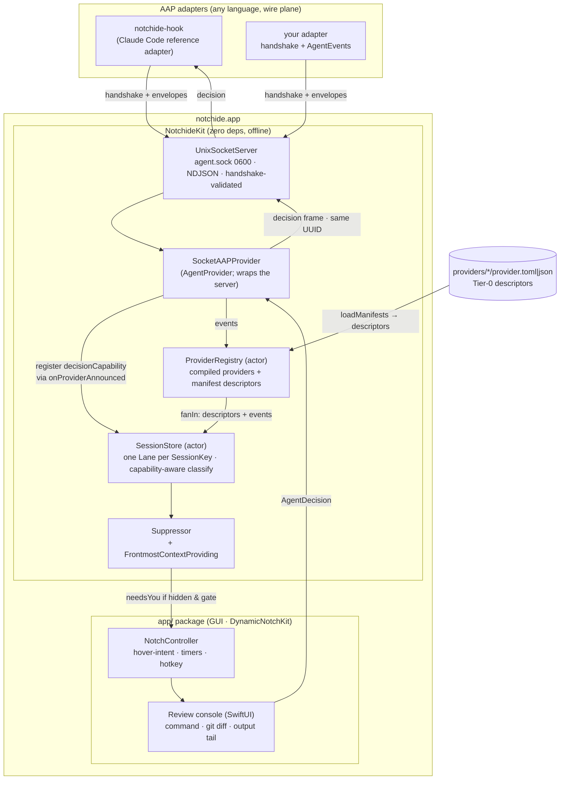

# notchide — Architecture

The engineering view: package layout, the two platform planes, key types, the concurrency
model, and how to build and run. The **normative wire protocol** is
[PROTOCOL.md](PROTOCOL.md); the product *why* is [DESIGN.md](DESIGN.md).

---

## 1. Package layout

notchide is two SwiftPM packages, split along one hard line: **the core has zero external
dependencies and builds offline; the GUI is where the outside world (DynamicNotchKit, Xcode,
private frameworks) lives.**

```
notchide/
├─ Package.swift                 # root package — the offline core
├─ Sources/
│  ├─ NotchideKit/               # pure library: AAP core, transport, sessions, suppression
│  └─ notchide-hook/             # the Claude Code reference adapter (thin; wraps NotchideKit)
├─ Tests/
│  └─ NotchideKitTests/          # runs fully offline (swift test) — incl. fail-open path
├─ schema/                       # aap-1.schema.json — machine-readable wire schema
├─ examples/                     # runnable adapters + provider manifest templates
└─ app/                          # nested package — the GUI, built on the developer's Mac
   ├─ Package.swift              # depends on DynamicNotchKit + NotchideKit (local path)
   ├─ project.yml                # XcodeGen spec → generates notchide.xcodeproj
   └─ Sources/notchide/          # SwiftUI/AppKit: NotchController, console, diff, tail
```

- **Root package (`NotchideKit` + `notchide-hook` + tests) — ZERO external dependencies.** The
  core (AAP framing, `SessionStore`, `Suppressor`, the lane/glyph model, the provider registry)
  builds and tests with nothing but the Swift toolchain, so CI runs fully offline on
  `macos-latest` and contributors can iterate on the hard parts without a network.
- **`app/` package — the GUI.** Depends on **DynamicNotchKit** (fetched over the network) and on
  **`NotchideKit` via a local path** (`../`). It draws to the notch and links private frameworks,
  so it is built on the developer's Mac with Xcode (via XcodeGen) and is **not** part of the
  offline CI job.

Planned diff-highlighting dependencies (**Neon**, **SwiftTreeSitter**, **CodeEditLanguages**)
live in the `app/` package too — never in the core.

---

## 2. Two planes

notchide is an open platform with two orthogonal extension planes. Understanding the split is
the key to the architecture:

1. **The AAP wire plane** — the [Agent Adapter Protocol](PROTOCOL.md). Any process, in any
   language, connects to an owner-only Unix socket, handshakes, and streams `AgentEvent`s. This
   is how *live agents* get in. The reference adapter is `notchide-hook` (Claude Code); the
   app-side ingress is `SocketAAPProvider` wrapping `UnixSocketServer`.
2. **The provider/contribution plane** — the in-process `AgentProvider` protocol and the
   on-disk provider **manifests**. This is how notchide *knows about* providers: their identity,
   capabilities, and decision capability, so it can classify their lanes correctly. `SocketAAPProvider`
   is itself a provider on this plane; `ProviderRegistry` fans every provider's events into the
   one `SessionStore`.

The wire plane carries *events*; the provider plane carries *descriptors and fan-in*. A live
Claude session, for example, arrives as socket frames (wire plane) that `SocketAAPProvider`
(provider plane) surfaces to the registry and store.

### 2.1 Provider tiers

The platform admits providers at three levels of effort and power:

| Tier | What you ship | What it can do | Status |
| ---- | ------------- | -------------- | ------ |
| **Tier-0 — drop a manifest** | A `provider.toml`/`.json` in `…/notchide/providers/<name>/` | Contributes a **descriptor** (id, displayName, capabilities, decisionCapability) so the app classifies the provider's lanes — even before any events arrive. Events still come from an adapter on the wire plane. | **Implemented** (`ProviderRegistry.loadManifests`) |
| **Tier-1 — declare contributions** | A richer manifest | The documented growth path for the manifest surface (beyond the descriptor). Today the parser reads only the four descriptor keys; anything more is roadmap. | **Partial** (descriptor only) |
| **Tier-2 — compiled provider** | An in-process `AgentProvider` | Full control: owns a live transport, resolves decisions, actuates. `SocketAAPProvider` (and the roadmap OTLP listener) are Tier-2. | **Implemented** (`AgentProvider` + `ProviderRegistry.register`) |

Manifests contribute *descriptors*, not code: Swift has no dynamic code loading, so a manifest
can never spin up a live provider — it makes a provider **known and correctly classified**,
while the events themselves arrive over the AAP socket.

---

## 3. Key types

All of these live in `NotchideKit` unless noted. Types are small and single-purpose.

### 3.1 AAP core (vendor-neutral)

- **`ProviderID`** — a stable reverse-DNS identity (`"sh.claude"`); encodes as a bare JSON
  string.
- **`Capability`** — `observe` / `gate` / `actuate`, advertised in the handshake.
- **`DecisionCapability`** — `.blocking` or `.notifyOnly`, **derived** from the capability set
  (`gate` ⇒ `.blocking`). This is the type that makes the security model structural (§4).
- **`AgentEvent`** — the one currency the whole cockpit consumes: `providerID`, `sessionKey`,
  `kind`, optional `cwd`/`title`/`command`/`decision`, the lossless vendor `payload`, and `at`.
  Its `Codable` is deliberately **lenient** — it never throws on unknown/missing fields.
- **`AgentEventKind`** — `started` / `progress` / `needsDecision` / `notified` / `finished` /
  `errored`; maps one-to-one onto the four lane states.
- **`DecisionRequest`** (`{id, prompt}`) and **`AgentDecision`** (`{id, verdict, reason?,
  redirect?}`) — the request carried on a `needsDecision` event and the reply written back.
  `PermissionDecision` is `allow` / `deny` / `ask`.
- **`GlyphTint`** — the fixed four-tint palette (`flowing`/`needsYou`/`done`/`error`); providers
  map into it, they do not invent colors.

### 3.2 Transport & wire types

- **`AAPHandshake`** — the first NDJSON line: `{aap, providerID, capabilities}`. Validated
  `aap == "1"`; lenient decode.
- **`AgentEnvelope`** — `{id, event, wantsDecision}`; the adapter→app frame.
- **`NDJSON`** — the one-object-per-line framing helpers.
- **`UnixSocketServer`** — the app-side listener bound to `agent.sock` (mode `0600`,
  `chmod`'d before `listen()`). Validates each connection's handshake, then reads envelopes and
  writes a decision back **iff** `wantsDecision` **and** the connection advertised `gate`.
- **`UnixSocketClient`** — the adapter-side connector: handshake, one envelope, optionally await
  one decision under a hard timeout (→ fail-open). Used by `notchide-hook` and tests.
- **`NotchidePaths`** — the canonical `agent.sock` path, the legacy `hook.sock` alias, and the
  `0700` support directory. `NOTCHIDE_SOCKET_PATH` overrides.

### 3.3 Provider plane

- **`AgentProvider`** — the "LSP/DAP-for-agents" server interface: `events()` streams
  `AgentEvent`s, `resolve(_:)` answers a blocking decision, `actuate(_:)` (no-op default) pushes
  actions back. Each provider exposes a `ProviderDescriptor`.
- **`ProviderDescriptor`** — the static declaration: `id`, `displayName`, `capabilities`,
  `decisionCapability`, and the `glyphTints` map.
- **`SocketAAPProvider`** — the app-side ingress. A concrete `AgentProvider` that **wraps
  `UnixSocketServer`**. Its own transport id is `sh.notchide.socket`; the *real* originating
  `providerID` (e.g. `sh.claude`) rides inside each event. Its `onProviderAnnounced` callback
  fires per handshake, wiring the announced `(providerID, DecisionCapability)` into
  `SessionStore.register` so lanes are classified per the handshake. `resolve(_:)` writes the
  decision frame back on the correlated open connection.
- **`ProviderRegistry`** — an `actor` holding compiled providers plus manifest descriptors.
  `loadManifests(from:)` scans `…/providers/*/provider.toml|json`; `fanIn(into:)` registers every
  descriptor's decision capability with the store, then pumps each provider's `events()` into
  `store.ingest`.
- **`ClaudeCodeProvider`** — the **reference provider**. The one place that knows Claude Code's
  snake_case fields and event names; owns the `HookEvent → AgentEvent` translation and provides
  the descriptor + handshake. Downstream sees only vendor-neutral `AgentEvent`s.

### 3.4 Session & attention types

- **`SessionKey`** — `(provider, agentSessionID, cwd)`. The lane key (§5).
- **`SessionStore`** — an `actor`; owns **one `Lane` per `SessionKey`** (`[SessionKey: Lane]`),
  classifies each event via the capability-aware `laneState`, holds pending decisions, and
  broadcasts snapshots the UI observes.
- **`Lane` / `LaneState`** — a tracked session and its coarse state (`flowing` / `needsYou` /
  `done` / `error`). `Lane.showsDecisionButtons` is `true` only for a `.blocking` provider in
  `needsYou` with a pending decision — the type-level gate on the write UI.
- **`Suppressor`** — the escalation policy: given a lane's kind, its provider's
  `DecisionCapability`, and a `FrontmostContextProviding`, decides whether to actively *tap* the
  user. A `.notifyOnly` provider can never tap.
- **`FrontmostContextProviding`** — abstracts "is this session visible?". The real
  AppKit/Accessibility implementation lives in `app/`; `StubFrontmostContext` makes the policy a
  pure, offline-testable predicate.

### 3.5 Claude Code adapter types

- **`HookEvent`** — a decoded Claude Code hook payload (snake_case; lenient; preserves unknown
  fields in `extra`).
- **`HookDecision`** — the outcome mapped to Claude Code's `PreToolUse` output
  (`hookSpecificOutput.permissionDecision` = `allow`/`deny`/`ask`, plus an optional
  `permissionDecisionReason`).

### 3.6 GUI types (in `app/`)

- **`NotchController`** — the thin owner of pill ↔ console state, the hover-intent state machine,
  and the ESC / pin / auto-collapse / summon-hotkey timers. Bridges the observed `SessionStore`
  to DynamicNotchKit's panel.

---

## 4. The capability model as a type-level guarantee

The single most important property of the platform is that a **notify-only provider is
structurally unable to seize the user** — this is enforced by types and classifiers, not by
convention:

1. The handshake capability set is reduced to a **`DecisionCapability`** (`gate` ⇒ `.blocking`,
   else `.notifyOnly`) at ingress.
2. **`SessionStore.laneState(for:decisionCapability:)`** clamps any `needsYou`-producing kind to
   `flowing` for a `.notifyOnly` provider. Such a provider's lane **cannot reach `needsYou`**.
3. **`Suppressor.isHardBlock`** returns `false` for every `.notifyOnly` provider, so it can never
   *tap* the user.
4. **`Lane.showsDecisionButtons`** requires `.blocking`, so the app never renders allow/deny/ask
   for a notify-only lane.
5. On the wire, `UnixSocketServer` / `SocketAAPProvider` only ever write a decision frame back
   when `wantsDecision` **and** the connection advertised `gate`.

Because a contributed provider's decision can approve arbitrary commands (`rm -rf …`), this
matters: absent `gate` on an owner-only, same-machine socket, escalation is *impossible*, not
merely disallowed. See [PROTOCOL.md §2](PROTOCOL.md#2-capability-model).

---

## 5. Session identity — namespacing & normalize-by-session

Every lane is keyed by **`SessionKey` = `(provider, agentSessionID, cwd)`**, reconstructed from
the flat event fields. Two providers that happen to reuse the same `agentSessionID` never
cross-wire into one lane because the `providerID` differs; enrichment providers that describe the
*same* session merge on the full tuple. The store normalizes by this key: repeated events for a
session update its one lane (state, last event/command, pending decision, timestamp) rather than
spawning duplicates.

---

## 6. Concurrency model (Swift 6)

- **Strict concurrency, `Sendable` throughout.** The package targets the **Swift 6** language
  mode with complete concurrency checking. Everything crossing an isolation boundary
  (`AgentEvent`, `AgentDecision`, `AgentEnvelope`, `Lane`, …) is `Sendable`.
- **`SessionStore` and `ProviderRegistry` are actors.** All lane mutation and all fan-in are
  serialized through actors; there is no shared mutable state in the core beyond the socket
  server's small lock.
- **The socket server uses dedicated threads, not the cooperative pool.** The accept loop and
  each connection run on their own `Thread`s doing blocking POSIX I/O, so a handler that
  legitimately blocks for minutes (a human deciding a gate) ties up only that one connection
  thread. A blocked gate is modeled app-side as a parked `CheckedContinuation` resumed by
  `resolve(_:)`.
- **UI is `@MainActor`.** The SwiftUI console and `NotchController` observe `SessionStore`
  snapshots across the actor boundary; decisions are sent back into the provider.
- **No polling anywhere.** Socket readability, actor messages, and SwiftUI observation are all
  event-driven. Idle CPU is ~0%.

---

## 7. Provider → registry → store → UI



The decision flows back down the **same still-open socket connection** that carried the gate.
The wire-level frame trace is [PROTOCOL.md §11](PROTOCOL.md#11-worked-example-a-blocked-permission-denied).

---

## 8. Build & run

### 8.1 The offline core

```sh
swift build          # NotchideKit + notchide-hook
swift test           # full offline suite (includes the fail-open timeout path)
```

Requires only the Swift 6 toolchain. No network, no Xcode project — exactly what CI runs
(`.github/workflows/ci.yml`).

### 8.2 The GUI app

```sh
cd app
xcodegen generate          # project.yml → notchide.xcodeproj
open notchide.xcodeproj      # build & run the `notchide` scheme in Xcode
```

The `app/` package resolves **DynamicNotchKit** over the network and links `NotchideKit` by
local path. It is built on the developer's Mac and is intentionally **not** part of CI.

### 8.3 Try the AAP path end-to-end

1. Build and run the GUI app (it creates `agent.sock`).
2. **Claude Code:** install the reference adapter with `notchide-hook install` (merges into
   `~/.claude/settings.json` with a diff + confirm — see [HOOKS.md](HOOKS.md)), then run a
   session that hits a permission gate from a background Space; watch the pill pulse amber, peek,
   and decide.
3. **Any agent:** connect your own adapter over the socket — start from
   [`examples/adapters/minimal-observe.sh`](../examples/adapters/minimal-observe.sh) and the
   normative [PROTOCOL.md](PROTOCOL.md).
