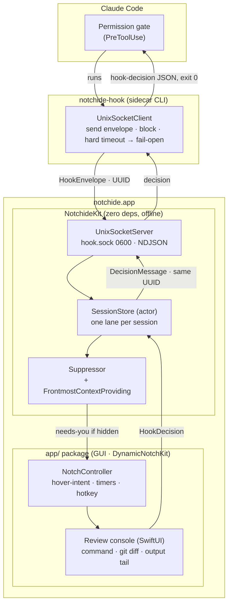

# notchide — Architecture

The engineering view: package layout, key types, the concurrency model, the IPC wire protocol,
and how to build and run. For the *why*, read [DESIGN.md](DESIGN.md).

---

## 1. Package layout

notchide is two SwiftPM packages, split along one hard line: **the core has zero external
dependencies and builds offline; the GUI is where the outside world (DynamicNotchKit, Xcode,
private frameworks) lives.**

```
notchide/
├─ Package.swift                 # root package — the offline core
├─ Sources/
│  ├─ NotchideKit/               # pure library: IPC, sessions, suppression, glyph model
│  └─ notchide-hook/             # the sidecar CLI executable (thin; wraps NotchideKit)
├─ Tests/
│  └─ NotchideKitTests/          # runs fully offline (swift test) — incl. fail-open path
└─ app/                          # nested package — the GUI, built on the developer's Mac
   ├─ Package.swift              # depends on DynamicNotchKit + NotchideKit (local path)
   ├─ project.yml                # XcodeGen spec → generates notchide.xcodeproj
   └─ Sources/notchide/          # SwiftUI/AppKit: NotchController, console, diff, tail
```

- **Root package (`NotchideKit` + `notchide-hook` + tests) — ZERO external dependencies.** This
  is deliberate: the core (IPC framing, `SessionStore`, `Suppressor`, lane/glyph model, the
  hook decision types) builds and tests with nothing but the Swift toolchain, so CI runs fully
  offline on `macos-latest` and contributors can iterate on the hard parts without a network.
- **`app/` package — the GUI.** Depends on **DynamicNotchKit** (fetched over the network) and on
  **`NotchideKit` via a local path** (`../`). It is built on the developer's Mac with Xcode
  (via XcodeGen), because it draws to the notch and links private frameworks — it is **not**
  part of the offline CI job.

Planned diff-highlighting dependencies (**Neon**, **SwiftTreeSitter**, **CodeEditLanguages**)
live in the `app/` package too — never in the core.

---

## 2. Key types

All of these live in `NotchideKit` unless noted. Types are small and single-purpose.

### 2.1 Hook contract types

- **`HookEvent`** — a decoded Claude Code hook payload: `sessionID`, `toolName`, `toolInput`,
  `cwd`, `hookEventName`, and the raw fields needed to render the command. `Codable`, `Sendable`.
- **`HookDecision`** — the outcome of a review, mapped to Claude Code's `PreToolUse` output:
  `.allow`, `.deny(reason:)`, `.redirect(String)`, `.approveAndRemember`. Knows how to serialize
  itself to the exact `hookSpecificOutput` JSON Claude Code expects.

### 2.2 IPC types

- **`HookEnvelope`** — what `notchide-hook` sends *up* the socket: a request `id: UUID`, the
  `HookEvent`, and `wantsDecision: Bool` (only a `PreToolUse` permission gate blocks for a
  decision). `Codable`, `Sendable`.
- **`DecisionMessage`** — what the app sends *back down*: the same request `id: UUID`, a
  `PermissionDecision` (`allow`/`deny`), an optional `reason`, and an optional `redirect`. The
  CLI maps these onto Claude Code's `PreToolUse` output. Correlation is by UUID (§4).
- **`PermissionDecision`** — `allow` / `deny`; the raw decision the sidecar prints for Claude
  Code. `HookDecision` is the higher-level review outcome (`allow` / `deny(reason:)` /
  `redirect` / approve-and-remember) that the app builds a `DecisionMessage` from.
- **`UnixSocketServer`** — the app-side listener bound to `hook.sock` (mode `0600`); accepts
  connections, reads NDJSON envelopes, and writes back the matching decision on the same
  connection.
- **`UnixSocketClient`** — the sidecar-side connector: sends one envelope, blocks awaiting the
  decision for its UUID (with a hard timeout → fail-open), used by `notchide-hook`.

### 2.3 Session & attention types

- **`SessionStore`** — an `actor`. Owns **one lane per session** (`[SessionID: Lane]`), routes
  incoming envelopes to the right lane, holds pending decisions, and is the single source of
  truth the UI observes.
- **`LaneState`** — the four-state glyph model: `.flowing`, `.needsYou`, `.done`, `.error`,
  plus the pending `HookEvent` and its awaiting continuation when blocked.
- **`Suppressor`** — the escalation policy: given a lane that just went pending and a
  `FrontmostContextProviding`, decides whether to escalate to `needs-you` (terminal hidden) or
  stay silent (terminal visible). Records the "why did this tap?" reason.
- **`FrontmostContextProviding`** — a protocol abstracting "what's frontmost on the active
  Space". A real AppKit/Accessibility implementation lives in `app/`; `StubFrontmostContext`
  (shipped in `NotchideKit` for tests) makes the suppression policy a pure, offline-testable
  predicate.

### 2.4 GUI types (in `app/`)

- **`NotchController`** — the thin owner of pill ↔ console state, the hover-intent state machine,
  and the ESC / pin / auto-collapse / summon-hotkey timers. Bridges `SessionStore` (observed) to
  DynamicNotchKit's panel.

---

## 3. Concurrency model (Swift 6)

- **Strict concurrency, `Sendable` throughout.** The package targets the **Swift 6** language
  mode with complete concurrency checking on. Everything that crosses an isolation boundary
  (`HookEvent`, `HookDecision`, `HookEnvelope`, `DecisionMessage`, `LaneState`) is `Sendable`.
- **`SessionStore` is an `actor`.** All mutation of lane state is serialized through it. There is
  no shared mutable state outside an actor and no locks in the core.
- **The blocked hook is modeled as a suspension.** When an envelope arrives for a lane, the
  awaiting request is held (as a continuation) until a `HookDecision` is produced by the UI or
  the timeout fires. The socket read/write on the app side is async; the *sidecar* side is a
  short-lived synchronous process that blocks on a socket read.
- **UI is `@MainActor`.** The SwiftUI console and `NotchController` are main-actor isolated and
  observe `SessionStore` across the actor boundary; decisions are sent back into the actor.
- **No polling anywhere.** Everything is event-driven — socket readability, actor messages, and
  SwiftUI observation. Idle CPU is ~0%.

---

## 4. IPC wire protocol

**Transport.** A Unix-domain stream socket at
`~/Library/Application Support/notchide/hook.sock`, created with mode **`0600`** (owner-only).
Local-only; there is no network surface.

**Framing.** **NDJSON** — newline-delimited JSON. One JSON object per line, `\n`-terminated.
Each line is a complete, independently-parseable message. This keeps the reader trivial (split
on newline, decode each line) and is friendly to both Swift `Codable` and hand-inspection with
`nc`/`jq` while debugging.

**Correlation.** Every request carries a **`UUID`**. The app replies with the **same UUID**, so a
connection that multiplexes more than one in-flight request still pairs each decision to its
envelope unambiguously. (In v0.1 the common case is one envelope per short-lived sidecar
connection, but the protocol is UUID-correlated by design so it generalizes.)

**Sequence for one blocked permission:**

```
notchide-hook (sidecar)                     notchide.app (UnixSocketServer)
        │                                              │
        │   connect(hook.sock)                         │
        │─────────────────────────────────────────────▶
        │                                              │
        │   {"id":"<uuid>","event":{ HookEvent … }}\n  │   ── envelope (NDJSON) ──▶ SessionStore
        │─────────────────────────────────────────────▶      lane → needs-you; Suppressor checks
        │                                              │      frontmost; UI eventually resolves
        │        ( sidecar blocks, hard timeout )      │
        │                                              │
        │   {"id":"<uuid>","decision":{ … }}\n         │   ◀── decision (NDJSON) ── UI click
        │◀─────────────────────────────────────────────
        │                                              │
   print hook-decision JSON to stdout, exit 0          │
```

**Fail-open (normative).** If the sidecar cannot connect, the socket is absent, or **no decision
arrives before the hard timeout**, `notchide-hook` writes **no decision** to stdout and exits
**`0`** — deferring to Claude Code's normal permission prompt. The agent is never blocked by
notchide being unavailable. This path is unit-tested.

**Envelope (illustrative):**

```jsonc
// sidecar → app  (HookEnvelope)
{ "id": "550e8400-e29b-41d4-a716-446655440000",
  "wantsDecision": true,
  "event": {
    "sessionId": "abc123",
    "rawHookEventName": "PreToolUse",
    "hookEventName": "PreToolUse",
    "toolName": "Bash",
    "toolInput": { "command": "rm -rf ./build" },
    "cwd": "/Users/dev/project"
  } }
```

**Decision (illustrative):**

```jsonc
// app → sidecar  (DecisionMessage)
{ "id": "550e8400-e29b-41d4-a716-446655440000",
  "permission": "deny",
  "reason": "not this build path",
  "redirect": "build with `swift build` instead" }
```

The sidecar then translates that into Claude Code's `PreToolUse` stdout schema
(`hookSpecificOutput.permissionDecision`, etc. — see [HOOKS.md](HOOKS.md)).

---

## 5. Component diagram



---

## 6. Build & run

### 6.1 The offline core

```sh
swift build          # NotchideKit + notchide-hook
swift test           # full offline suite (includes the fail-open timeout path)
```

Requires only the Swift 6 toolchain. No network, no Xcode project. This is exactly what CI runs
(see `.github/workflows/ci.yml`).

### 6.2 The GUI app

```sh
cd app
xcodegen generate          # project.yml → notchide.xcodeproj
open notchide.xcodeproj      # build & run the `notchide` scheme in Xcode
```

The `app/` package resolves **DynamicNotchKit** over the network and links against
`NotchideKit` by local path. It is built on the developer's Mac (it draws to the notch and links
private frameworks) and is intentionally **not** part of CI.

### 6.3 Try the hook path end-to-end

1. Build and run the GUI app (it creates `hook.sock`).
2. Install the hook: `notchide-hook install` (merges into `~/.claude/settings.json` with a
   diff + confirm — see [HOOKS.md](HOOKS.md)).
3. Run a Claude Code session that hits a permission gate from a background Space; watch the pill
   pulse amber, peek, and decide.
4. Uninstall cleanly with `notchide-hook uninstall`.
